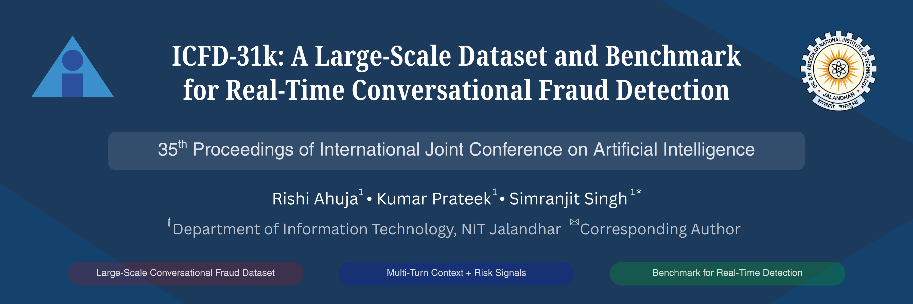

<div align="center">



# ICFD-31k

### A Large-Scale Dataset and Benchmark for Real-Time Conversational Fraud Detection

[](https://ijcai.org/)
[](https://huggingface.co/datasets/rishia2220/icfd-31k)
[](LICENSE)
[](LICENSE-DATA.md)

**[Rishi Ahuja](https://scholar.google.com/citations?user=EZff3KsAAAAJ&hl=en)** · [Personal Site](https://rishia.in)

**[Kumar Prateek](https://scholar.google.com/citations?user=yBNfbLwAAAAJ)** · [Personal Site](https://sites.google.com/view/kumarprateek/)

**[Simranjit Singh](https://scholar.google.co.in/citations?user=uVD29RwAAAAJ&hl=en)**

Department of Information Technology, Dr. B.R. Ambedkar National Institute of Technology Jalandhar, Punjab, India

Accepted at **IJCAI-ECAI 2026** · AI for Social Good Track

[Dataset](https://huggingface.co/datasets/rishia2220/icfd-31k) · [Dataset Card](DATASET_CARD.md) · [Data Access](DATA_ACCESS.md) · [Reproducibility](REPRODUCIBILITY.md)

</div>

---

Telephone scams cause large-scale financial and social harm, yet research on real-time countermeasures is held back by the absence of open, large-scale conversational data. **ICFD-31k** is the first Indian Conversational Fraud Dataset: a benchmark of **31,000+** realistic, bilingual (English/Hinglish) phone-call transcripts built for detecting fraud *as a conversation unfolds*, before the full call is heard.

Each transcript carries a final verdict, **chunk-level streaming labels** at 3-second intervals, extracted entities and policy violations, and detailed *slow-thinking* rationales—enabling static classification, streaming detection, and cross-domain generalization in a single resource.

## Highlights

- **31,000+** conversations across **10** fraud umbrellas, plus **5** unseen fraud types for cross-domain evaluation.
- **1,111,071** cumulative streaming chunks for real-time, mid-call detection.
- Rich, structured annotations: verdicts, chunk labels, key entities, violated policies, and rationales.
- Human-in-the-loop validation with mean pairwise Cohen's κ = **0.534** (moderate agreement).
- Reproducible release: generation pipeline, scenario/persona/entity libraries, diagnostics, and baselines.

## Benchmark

| Model | Task | F1 | Accuracy |
|---|---|---|---|
| Gemma-2 (zero-shot) | Static | 35.8 | 28.9 |
| RoBERTa M1 (fine-tuned) | Static | **99.6** | 99.6 |
| RoBERTa M2 (fine-tuned) | Streaming | **95.6** | 95.4 |

M2 detects **99.8%** of fraudulent calls with a median detection time of **30 seconds**.

## Access

The dataset is hosted on the Hugging Face Hub:

```python
from datasets import load_dataset

dataset = load_dataset("rishia2220/icfd-31k")
```

Representative examples are included in this repository under `examples/`. See [DATA_ACCESS.md](DATA_ACCESS.md) for the full release, sharding, and checksum workflow.

## Responsible Use

ICFD-31k is released for **defensive research and education only**—fraud detection, real-time warning systems, conversational safety, and explainable AI. It must not be used to generate scam scripts, automate social engineering, or build any tool that facilitates fraud. All names, numbers, and account details are synthetic. Use is governed by [LICENSE-DATA.md](LICENSE-DATA.md).

## Citation

```bibtex
@inproceedings{ahuja2026icfd31k,
  title     = {{ICFD-31k}: A Large-Scale Dataset and Benchmark for Real-Time Conversational Fraud Detection},
  author    = {Ahuja, Rishi and Prateek, Kumar and Singh, Simranjit},
  booktitle = {Proceedings of the Thirty-Fifth International Joint Conference on Artificial Intelligence (IJCAI-ECAI)},
  year      = {2026}
}
```

## License

Code is released under the [MIT License](LICENSE). Dataset use is governed by [LICENSE-DATA.md](LICENSE-DATA.md).
